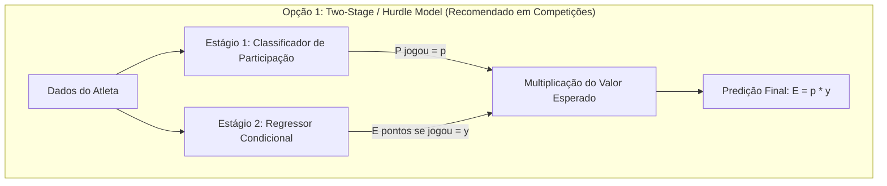

Para lidar com a previsão no Cartola FC em modelos baseados em árvores (LightGBM, XGBoost, CatBoost), enfrentamos um desafio clássico de **Distribuição Contínua Inflacionada de Zeros (*Zero-Inflated Continuous Distribution*)**: cerca de $58\%$ dos registros na base são de atletas que não entraram em campo (pontuação $= 0,0$), somados a uma cauda de pontuações reais que vai de $-8,0$ até $+25,0\text{ pts}$.

Abaixo estão as **opções arquiteturais**, suas formulações matemáticas e os **trade-offs de engenharia** para você tomar a decisão:

---

### 1. Estratégias para Lidar com Atletas que Não Jogam

#### **Opção 1: Modelo em Dois Estágios (*Two-Stage / Hurdle Model*)**
* **Como Funciona:**
  1. **Estágio 1 (Classificação Binária):** Um modelo (ex: LightGBM Classifier) prevê a probabilidade do atleta entrar em campo:
     $$\hat{p}_i = P(\text{entrou\_em\_campo} = 1 \mid X_i)$$
  2. **Estágio 2 (Regressão Condicional):** Um modelo (ex: LightGBM Regressor) treinado **estritamente com o subconjunto de atletas que efetivamente jogaram** ($\text{entrou\_em\_campo} == \text{True}$) prevê o potencial de pontos caso atue:
     $$\hat{y}_i = E[\text{pontos\_num} \mid \text{entrou\_em\_campo} = 1, X_i]$$
  3. **Valor Esperado Final:**
     $$\hat{E}[\text{pontos}_i] = \hat{p}_i \times \hat{y}_i$$
* **Trade-offs:**
  * ✅ **Vantagem:** Desacopla o ruído de escalação da capacidade técnica do atleta. O regressor aprende o verdadeiro potencial sem ser contaminado por 58.000 zeros artificiais.
  * ✅ **Vantagem:** Permite calibrar probabilidades no Estágio 1 (via *Platt Scaling* ou *Isotonic Regression*) e usar *Huber Loss* no Estágio 2 para proteger contra outliers de atacantes.
  * ❌ **Desvantagem:** Dobra o número de modelos a serem treinados e monitorados. Se o classificador errar ($\hat{p} \approx 0$), o valor esperado zera mesmo para um craque.

---

#### **Opção 2: Modelo Único com Função de Perda para Distribuições Mistas (Tweedie / Huber)**
* **Como Funciona:**
  * Treina um único modelo regressor em toda a base usando uma distribuição de probabilidade da família exponencial composta (como a *Tweedie* com parâmetro de variância $1 < p < 2$).
* **Trade-offs:**
  * ✅ **Vantagem:** Pipeline simples com apenas um modelo.
  * ❌ **Desvantagem Crítica no Cartola:** A distribuição Tweedie exige valores estritamente não-negativos ($y \ge 0$). No Cartola, defensores pontuam frequentemente negativo (até $-8\text{ pts}$), o que exigiria aplicar um deslocamento artificial na variável resposta ($y' = y + 10$).
  * ❌ **Desvantagem:** As árvores tendem a colapsar a predição para valores baixos ($\sim 1,5\text{ pts}$) para minimizar o erro médio quadrático diante da massa esmagadora de zeros.

---

#### **Opção 3: Filtro Determinístico com Regras de Domínio + Regressor**
* **Como Funciona:**
  * Cria uma regra rígida na inferência: se `status_pre != 'Provável'` e `taxa_participacao_3j == 0`, fixa $\hat{E}[\text{pontos}] = 0$. Os demais registros passam por um regressor único.
* **Trade-offs:**
  * ✅ **Vantagem:** Extremamente rápido e de fácil implementação.
  * ❌ **Desvantagem:** Rígido demais; penaliza atletas que voltam de lesão ou reservas que assumem a titularidade de última hora e pontuam bem.

---

### 2. Melhores Práticas para Alimentar as Features nas Árvores

Para maximizar a eficiência dos modelos baseados em árvores (LightGBM/XGBoost/CatBoost) com as variáveis que criamos:

1. **Tratamento de Categóricas de Alta Cardinalidade (`clube_id`, `opponent`, `posicao_id`):**
   * *Abordagem recomendada:* Usar a tipagem nativa `category` no LightGBM/CatBoost, que usa o algoritmo de partição ótima de Fisher ($O(K \log K)$) em vez de One-Hot Encoding (que fragmenta as árvores e dilui a profundidade).
2. **Uso das Features Compostas de Interação:**
   * Features que calculamos previamente (como `potencial_esperado_atleta`, `indice_favoritismo_mando` e `score_risco_rotacao`) entregam as relações não-lineares prontas, poupando a árvore de gastar $4$ ou $5$ níveis de profundidade (*splits*) para tentar aproximar uma multiplicação.
3. **Estratégia de Validação Temporal:**
   * **Nunca** usar *K-Fold aleatório*. A validação deve ser temporal estrita (*Expanding Window* ou *Purged Group TimeSeries Split*), por exemplo:
     * Treino: $2021$ e $2022$ | Validação: $2023$ | Teste/OOS: $2024$.

---

### Decisão Arquitetural:
Qual dessas abordagens você prefere adotar para estruturarmos o próximo notebook (Notebook 04: Modelagem e Validação)?
1. **Abordagem A:** Arquitetura em Dois Estágios (*Two-Stage / Hurdle*: Classificador de Participação + Regressor de Pontos).
2. **Abordagem B:** Modelo Único com regressão e pesos de amostra (*Sample Weights*).
3. **Abordagem C:** Modelos Especializados por Posição (Goleiros, Defesa, Meio/Ataque, Técnicos).

Comentário Matheus: eu gostei da opção A e achei a opção B interessante, visto a simplicidade