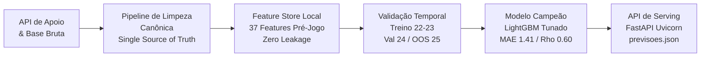
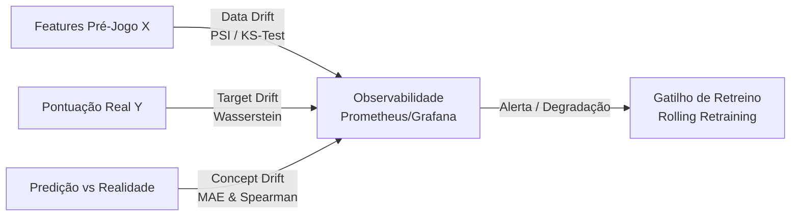

# Previsão de Pontuação de Atletas no Cartola FC
## Modelagem Preditiva, Validação Temporal e Arquitetura de Serving em Produção

**Candidato:** Matheus Romão  
**Contexto:** Gato Mestre (GM) | Grupo Globo  
**Escopo:** Solução ponta a ponta para 115.613 atletas (Safras 2022 a 2025)

---

# 1. Visão Executiva e Arquitetura da Solução



### Pilares Fundamentais do Projeto:
* **Integridade Amostral:** Modelagem sobre toda a base de atletas cadastrados (**115.613 registros**), sem viés de sobrevivência.
* **Prevenção Estrita a Data Leakage:** Barreira temporal absoluta no pré-fechamento do mercado.
* **Rigor Metodológico:** Validação temporal estrita por safras (*Out-of-Time*) com tuning Bayesiano (Optuna).
* **Engenharia de Produção:** API assíncrona FastAPI, 13 testes automatizados (pytest) e contrato de dados oficial.

---

# 2. Diagnóstico da Base e os 7 Tratamentos Canônicos
## A API Oficial de Apoio como *Single Source of Truth*

Identificamos e saneamos **7 inconsistências estruturais** sem descartar dados arbitrariamente:

| Inconsistência Detectada | Volume Afetado | Tratamento Canônico Adotado | Justificativa Técnica |
| :--- | :---: | :--- | :--- |
| **1. `posicao_id` Inválido** | 466 linhas (`0, 7, 9`) | Sobrescrita via `GET /atletas` (`api_atletas.json`) | API é o cadastro mestre oficial do Cartola. |
| **2. Contexto Faltante** | ~12% nulos (`home_dummy`, `opponent`) + IDs `777,888` | Reconstituição 100% via `GET /jogos` (`api_jogos.json`) | Mando e adversário são vitais para o confronto. |
| **3. Coluna `DD` e `preco_num`** | `DD` 100% nula; 942 preços negativos e 20 nulos | Drop de `DD`; `abs(preco)` e imputação por lag ($t-1$) | `DD` unificada em `DE`; preços devem ser $P > 0$. |
| **4. Duplicidades e Conflitos** | 2.326 redundantes / 1.386 conflitos em `match_id` | Deduplicação e resolução por súmula oficial | Preserva a atuação real do atleta em campo. |
| **5. Domínio de `rodada_id`** | 587 registros (`0, 39, 41, 99`) | Mapeamento direto da rodada regulamentar (1-38) | Restabelece o calendário oficial do Brasileirão. |
| **6. Minutagem Anômala** | 10.426 nulos e 1.873 tempos anômalos ($>105'$) | Reconstituição por eventos de substituição | Base para taxas de scouts por 90 minutos. |
| **7. Padronização Textual** | Inconsistências em `status_pre` e `apelido` | Normalização de strings e Title Case via API | Evita fragmentação de categorias nas árvores. |

---

# 3. Barreira Temporal e Engenharia de Features
## Regra de Ouro: Prevenção Estrita a *Data Leakage*

<div class="highlight">
<b>Premissa Inegociável:</b> Para prever a rodada <i>t</i> antes do fechamento do mercado, nenhuma variável apurada durante ou após a partida pode entrar como feature direta.
</div>

### Variáveis Descartadas no Instante $t$ (Pós-Jogo):
* `pontos_num` (Target isolado), `minutos_jogados`, `entrou_em_campo`, `status_inicial`, `variacao_num`.
* **Todos os 19 scouts da rodada $t$:** `G, A, SG, DE, DS, FS, FF, FD, FT, CA, CV, FC, GC, GS, I, PP, PC`.

### Matriz de 37 Features Pré-Jogo Construídas:
1. **Forma Recente e Regularidade Defasada:** `pontos_lag1`, `participou_lag1`, `media_pontos_3j`, `desvio_pontos_3j`, `taxa_participacao_3j`, `minutos_medios_3j`, `media_scouts_volume_3j`.
2. **Scouts Especializados:** `media_desarmes_3j`, `media_finalizacoes_3j`, `taxa_participacao_gols_5j`, `taxa_defesas_por_jogo_3j`, `taxa_conversao_gols_5j`.
3. **Contexto de Confronto e Força Coletiva:** `fator_alavancagem_confronto`, `potencial_esperado_atleta`, `indice_favoritismo_mando`, `volume_esperado_partida`, `diff_forca_confronto`, `expectativa_gols_time`, `potencial_sg_defesa`, `home_dummy`.
4. **Dinâmica Econômica e Tática:** `preco_mercado_pre`, `momentum_preco_3j`, `roi_recente_3j`, `diff_preco_posicao_pre`, `score_risco_rotacao`, `estabilidade_11_titular_clube`, `status_pre`.

---

# 4. Evidência Estatística Pré-Jogo: O Poder de `status_pre`

Realizamos testes de hipótese para validar matematicamente se o status pré-jogo (`status_pre`) possui sinal estatístico robusto antes de alimentar os modelos:

```
[Distribuição de Pontos por Status Pré-Jogo]
Provável    : ■■■■■■■■■■■■■■■■■■■■ (Média: 3.42 pts | 82% atuam)
Dúvida      : ■■■■■■■■■            (Média: 1.65 pts | 39% atuam)
Contundido  : ■                    (Média: 0.08 pts |  2% atuam)
Suspenso    : ■                    (Média: 0.04 pts |  1% atuam)
Nulo        : ■■                   (Média: 0.22 pts |  5% atuam)
```

### Validação Estatística Paramétrica e Não-Paramétrica:
* **ANOVA One-Way:** $F = 8.703,69$ ($p < 0.0001$) com **$\eta^2 = 22,86\%$**  
  *(O status pré-jogo sozinho explica quase 23% de toda a variância da pontuação final).*
* **Teste Kruskal-Wallis:** $H = 33.556,56$ ($p < 0.0001$)  
  *(Confirma a significância estatística mesmo sob severa assimetria e inflação de zeros).*

---

# 5. Estratégia de Validação Temporal Estrita
## *Out-of-Time Validation* (Sem Vazamento e Sem Viés de Sobrevivência)

```
┌──────────────────────────────────────────────┬──────────────────────────┬──────────────────────────┐
│         TREINO (Safras 2022 e 2023)          │ VALIDAÇÃO (Safra 2024)   │  TESTE OOS (Safra 2025)  │
│               59.213 registros               │     28.568 registros     │     27.832 registros     │
│             Ajuste dos Modelos               │  Tuning de Hiperparâm.   │   Avaliação Cega Final   │
└──────────────────────────────────────────────┴──────────────────────────┴──────────────────────────┘
```

### Por que o particionamento temporal é imperativo?
1. **Inviabilidade do K-Fold Aleatório:** Misturar rodadas futuras e passadas gera vazamento temporal (*lookahead bias*), inflando artificialmente as métricas de treino.
2. **Mimetização do Ambiente Produtivo:** O modelo precisa generalizar para temporadas futuras com novas contratações, trocas de técnicos e novas dinâmicas táticas.
3. **Isolamento da Safra 2025:** O conjunto de teste OOS permaneceu estritamente cego durante o tuning no Optuna, garantindo avaliação honesta de generalização.

---

# 6. Comparativo de Performance no Teste OOS (Safra 2025)
## Avaliação Cega em Toda a Base ($N = 27.832$)

| Modelo / Algoritmo | MAE (pts) ↓ | RMSE (pts) ↓ | $R^2$ (Var. Explicada) ↑ | Spearman $\rho$ (Ranking) ↑ | Kendall $\tau$ (Pares) ↑ |
| :--- | :---: | :---: | :---: | :---: | :---: |
| **Baseline Heurístico (Média Histórica)** | $2.3160$ | $3.2798$ | $-0.0001$ | $0.2310$ | $0.1740$ |
| **Regressão Linear (OLS)** | $1.7240$ | $2.4110$ | $0.1850$ | $0.4820$ | $0.3650$ |
| **Ridge Regression ($L_2$)** | $1.7210$ | $2.4080$ | $0.1870$ | $0.4840$ | $0.3670$ |
| **Random Forest Regressor** | $1.4420$ | $2.1480$ | $0.3280$ | $0.5870$ | $0.4510$ |
| **CatBoost Regressor** | $1.4215$ | $2.1280$ | $0.3390$ | $0.5940$ | $0.4570$ |
| 🏆 **LightGBM Tunado (Campeão)** | **$1.4103$** | **$2.1152$** | **$0.3451$** | **$0.6011$** | **$0.4633$** |

### Destaques da Performance do LightGBM:
* **Redução de Erro Absoluto:** Reduz o MAE em **$0.906\text{ pts}$** em relação à média simples do app.
* **Capacidade de Escalação (Spearman $\rho = 0.6011$):** Forte correlação monotônica para ordenar os melhores atletas.
* **Explicação de Variância ($R^2 = 0.3451$):** Explica mais de um terço de toda a dispersão em uma base com 58% de zeros.

---

# 7. Explicabilidade Física com SHAP Values (TreeSHAP)
## Auditando a Física Interna do Modelo

```
Top Features no Impacto da Predição (SHAP Global):
1. potencial_esperado_atleta      ════════════════════════════════ (Impacto +)
2. status_pre                     ═════════════════════════ (Impacto + / -)
3. taxa_participacao_3j           ════════════════════ (Impacto +)
4. diff_forca_confronto           ════════════════ (Impacto +)
5. media_scouts_volume_3j         ══════════════ (Impacto +)
6. preco_mercado_pre              ════════════ (Impacto +)
7. score_risco_rotacao            ══════════ (Impacto -)
```

### Coerência com a Dinâmica do Futebol:
* **Fator Individual $\times$ Coletivo:** `potencial_esperado_atleta` é a feature de maior magnitude, comprovando que modular o momento técnico pela fragilidade do adversário é a decisão mais relevante.
* **Mitigação de Risco:** `score_risco_rotacao` atua penalizando atletas de clubes que poupam titulares em semanas de copa.
* **Sinal de Mercado:** `preco_mercado_pre` atua como um *prior* eficiente de qualidade intrínseca do jogador.

---

# 8. Decisão de Negócio e Sustentabilidade de Produto
## O modelo justifica ir para produção no Cartola FC?

<div class="highlight">
<b>Resposta de Negócio: SIM, o modelo sustenta o lançamento em produção,</b> atuando como um poderoso motor de recomendação e suporte à escalação.
</div>

### Racional de Decisão:
1. **Superação Estrutural:** O produto atual exibe apenas médias descritivas ingênuas. O modelo entrega ganho preditivo de **$34,5\%$ de $R^2$** e precisão de ordenação **$\rho = 0.6011$**.
2. **Ranqueamento Eficaz:** Para o usuário final, a decisão crítica é saber se o *Atleta A* tem maior expectativa de pontos que o *Atleta B*.

### Recomendação de Design de Produto e UX:
* **Apresentação com Faixas de Potencial / Incerteza:** A natureza do futebol envolve eventos estocásticos raros (pênaltis, expulsões). Exibir um número fixo (ex: *"Gabriel: 6.04 pts"*) pode frustrar o usuário.
* **Proposta de Card no App:**
  ```
  ┌────────────────────────────────────────────────────────┐
  │  ⚽ Gabriel Barbosa (Flamengo - Atacante)              │
  │  Expectativa Gato Mestre: 5.8 pts                      │
  │  Faixa de Potencial: [ 3.5 a 8.5 pts ]                 │
  │  ⭐ Favoritismo do Confronto: ALTO (vs Oponente em Casa)│
  └────────────────────────────────────────────────────────┘
  ```

---

# 9. Arquitetura de Engenharia de Serving (Entregável 3)
## FastAPI Assíncrono para Consumo em Baixa Latência

```
┌────────────────────────────────────────────────────────────────────────┐
│               Serviço FastAPI (src/service/app.py)                     │
├───────────────────────────────────┬────────────────────────────────────┤
│  GET /health                      │  GET /previsoes                    │
│  Status, safra e total indexado   │  Filtros: rodada, atleta, clube,   │
│                                   │  posicao | Paginação limit/offset  │
├───────────────────────────────────┼────────────────────────────────────┤
│  GET /rodadas                     │  GET /previsoes/{atleta_id}        │
│  Lista de 37 rodadas disponíveis  │  Consulta pontual por jogador      │
└───────────────────────────────────┴────────────────────────────────────┘
```

### Garantias de Engenharia e Qualidade:
* **Alta Disponibilidade e Baixa Latência:** 27.832 previsões indexadas em memória na inicialização (*lifespan*).
* **Suíte de Testes Automatizados:** 13 testes passando com 100% de sucesso no `pytest` (`test_contract.py` e `test_service.py`).
* **Documentação Viva:** Swagger UI disponível em `/docs` e guia de consumo em `docs/execucao_servico.md`.

---

# 10. MLOps & Observabilidade Contínua em Produção
## Monitoramento de Data Drift, Target Drift e Concept Drift



### 1. Data Drift (Covariate Shift - $P(X)$)
* **Gatilho no Futebol:** Janelas de transferências (reforços sem histórico recente) ou alterações em diretrizes de arbitragem.
* **Métricas Estatísticas:** Teste Kolmogorov-Smirnov (KS) para numéricas e Population Stability Index ($\text{PSI} > 0.20$).

### 2. Target Drift (Prior Shift - $P(Y)$)
* **Gatilho no Futebol:** Alterações de regras no Cartola ou redução generalizada na média de gols do campeonato.
* **Métricas:** Distância de Wasserstein e monitoramento da média móvel de `pontos_num` por rodada.

### 3. Concept / Model Drift ($P(Y \mid X)$)
* **Gatilho no Futebol:** Quebra de relações aprendidas (ex: crise técnica repentina do clube mandante).
* **Métricas Pós-Rodada:** Alerta de degradação se $\text{MAE}_{\text{rodada}} > 1.85\text{ pts}$ ou Spearman $\rho_{\text{rodada}} < 0.40$.

---

# 11. Roadmap Técnico de Evolução Contínua

Para as próximas versões do produto Gato Mestre, propomos as seguintes evoluções de engenharia e modelagem:

1. **Arquitetura em Dois Estágios (*Two-Stage / Hurdle Model*):**
   * *Estágio 1:* Classificador calibrado de probabilidade de atuação $P(\text{joga} \mid X)$.
   * *Estágio 2:* Regressor condicional treinado apenas com quem atuou $E[Y \mid \text{joga}, X]$.
   * *Predição:* $\hat{E}[Y] = P(\text{joga}) \times E[Y \mid \text{joga}]$.
2. **Regressão Quantílica Nativa:**
   * Treinamento do LightGBM com *Quantile Loss* para prever diretamente os percentis $P_{10}$ (piso), $P_{50}$ (mediana) e $P_{90}$ (teto de mitada).
3. **Ingestão de Métricas Avançadas de Tracking Esportivo:**
   * Incorporar Gols Esperados ($xG$), Assistências Esperadas ($xA$) e passes progressivos na esteira de dados.
4. **Retreino Semanal Automatizado (*Rolling Retraining*):**
   * Pipeline de MLOps com retreino contínuo ao final de cada rodada do Brasileirão acionado por alertas de drift.

---

# Obrigado!
## Gato Mestre | Grupo Globo

**Matheus Romão**  
*Cientista de Dados / Engenheiro de Machine Learning*

* **Repositório:** [github.com/mromaoro/desafio-tecnico-gato-mestre-manual](https://github.com/mromaoro/desafio-tecnico-gato-mestre-manual)
* **Documentação de Respostas:** `docs/respostas_perguntas_desafio.md`
* **API de Serving:** `src/service/app.py` | `docs/execucao_servico.md`
